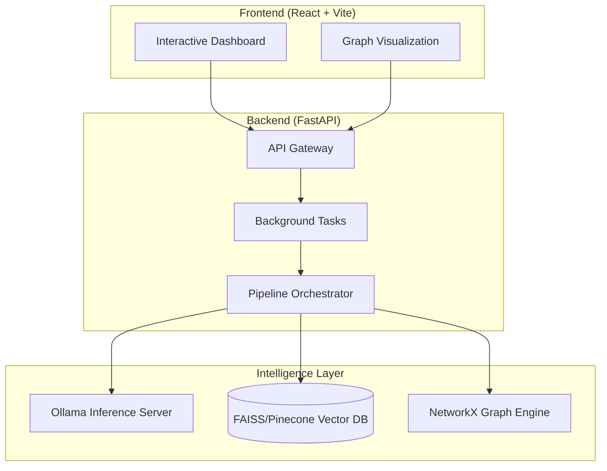

# 🔬 ResearchGraph

**ResearchGraph** is an enterprise-grade Multi-Modal RAG (Retrieval-Augmented Generation) ecosystem designed for researchers and knowledge workers. It seamlessly integrates unstructured data—PDFs, images, and audio—into a unified, searchable, and graph-enhanced knowledge repository.

---

## Key Features
- **Multi-Modal Ingestion**: Support for PDF research papers, image-based charts, and audio field notes.
- **Local AI Sovereignty**: Powered by Ollama for local LLM (Llama 3, TinyLlama) and Embedding inference.
- **Graph-Augmented Retrieval**: Enhances standard RAG with a Knowledge Graph to discover non-obvious connections.
- **Interactive Visualization**: Dynamic, interactive graph UI for exploring document relationships.
- **Background Indexing**: High-performance, non-blocking pipeline for processing large datasets.

---

## System Architecture
ResearchGraph follows a decoupled architecture separating data processing, AI inference, and user interaction.



---

## The Research Flow

### 1. Data Ingestion & Extraction
Documents are processed through a multi-stage parser:
- **PDFs**: Text extraction and layout analysis.
- **Images**: Visual explanation generation using multi-modal LLMs.
- **Audio**: Transcription and semantic chunking.

### 2. Knowledge Indexing
- **Semantic Vectorization**: Chunks are embedded into a high-dimensional vector space.
- **Entity Extraction**: Automated identification of key concepts, authors, and methodologies.
- **Relationship Mapping**: Linking entities across different documents to form a global knowledge network.

### 3. Intelligence Retrieval
- **Hybrid Search**: Combines vector similarity search with graph traversal to find the most relevant context.
- **Synthesized Answers**: LLM generates grounded responses with source citations.

---

## Tech Stack
| Component | Technology |
| :--- | :--- |
| **Backend** | Python 3.10+, FastAPI, Uvicorn |
| **Frontend** | React, Vite, D3.js/React-Force-Graph |
| **AI Models** | Ollama (Llama 3, Nomic-Embed) |
| **Vector DB** | FAISS / Pinecone |
| **Graph DB** | NetworkX (In-memory/Persistent) |
| **DevOps** | Docker, Docker Compose |

---

## Quick Start

### Prerequisites
- [Ollama](https://ollama.com/) installed and running.
- Node.js (v18+) & Python (v3.10+).

### 1. Backend Setup
```bash
cd backend
python -m venv venv
source venv/bin/activate  # Windows: .\venv\Scripts\activate
pip install -r requirements.txt
python -m uvicorn app.main:app --reload
```

**Quick Start (Windows):**
To start both the Backend and Frontend with a single command, run:
```bash
./start_backend.bat
```
This script will launch the FastAPI server in a separate window (with auto-restart) and start the Vite dev server in your current terminal.

### 2. Frontend Setup
```bash
cd frontend
npm install
npm run dev
```

---

## Repository Layout
```text
.
├── backend/            # FastAPI Application
│   ├── app/            # Core Logic (RAG, Graph, API)
│   └── data/           # Processed vector stores and graphs
├── frontend/           # React Application
│   ├── src/            # Components & Visualization
│   └── public/         # Assets
├── data/               # Raw Input (ResearchPapers, Images, Audio)
└── docker-compose.yml  # Orchestration
```

---

## API Overview
| Endpoint | Method | Description |
| :--- | :--- | :--- |
| `/upload` | `POST` | Upload PDF research papers |
| `/upload-audio`| `POST` | Upload audio notes |
| `/build-index` | `POST` | Trigger background indexing |
| `/query` | `POST` | Ask a question to the knowledge base |
| `/graph` | `GET` | Retrieve knowledge graph data |
